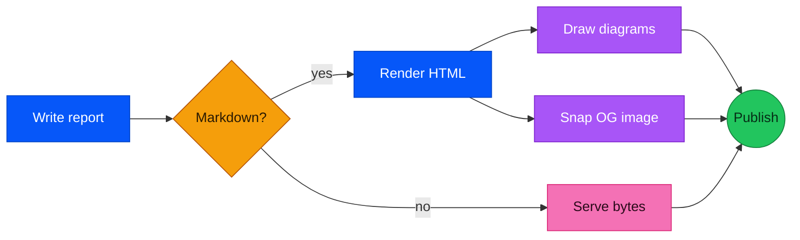
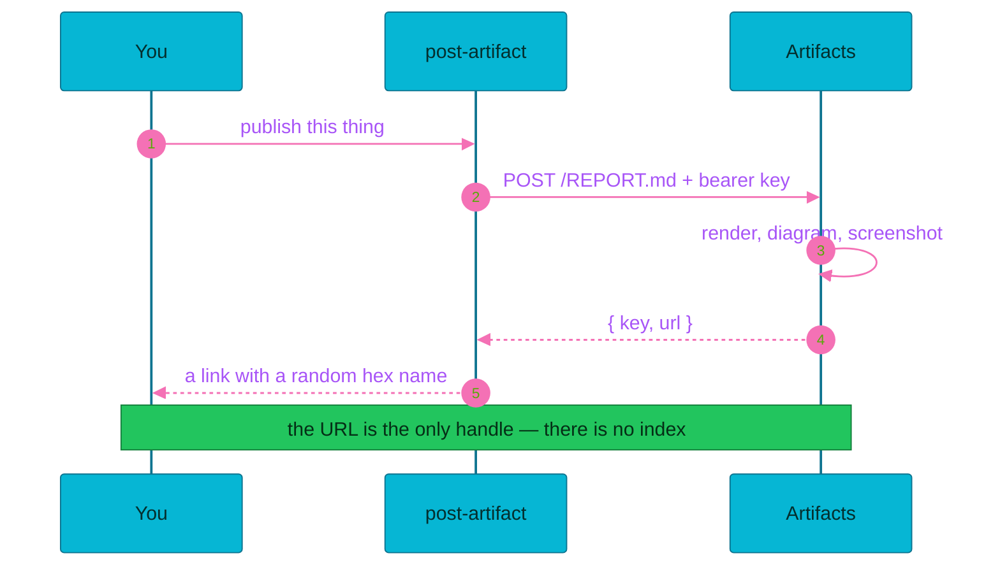
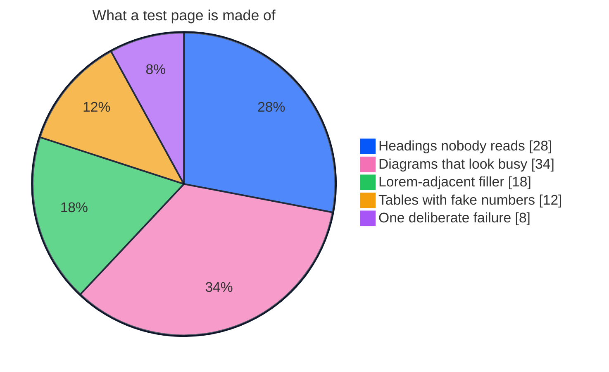
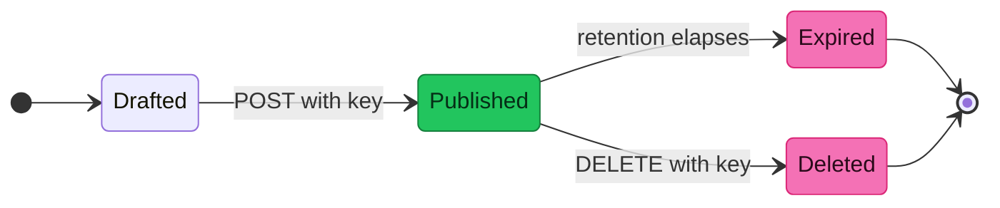

# Yearn Artifacts Test Page

---

## The size ladder

Markdown gives you six heading sizes and one body size, so this is the whole range.

# h1 — the big loud one
## h2 — still shouting
### h3 — indoor voice
#### h4 — polite
##### h5 — muttering
###### h6 — the small print

Body text sits here at 1rem with a comfortable 1.7 line height, and `inline code drops
to 0.875rem` — which is as little as text gets without raw HTML, because the renderer
escapes it on purpose.

> A blockquote, for when the text needs to lean.

---

## Colorful charts

### A flowchart that colors its own nodes



### A sequence diagram with a pinned palette



### A pie chart, because pie



### A state machine



Click any diagram to zoom it. Toggle the page theme and they all re-render — the ones
with pinned palettes keep their colors, the flowchart's `classDef` fills stay put, and
everything else follows the theme.

---

## Tables, lists, and the rest

| Retention | URL prefix | Good for |
| --- | --- | --- |
| `1d` | `/1d/` | test pages exactly like this one |
| `7d` | `/7d/` | something a review thread will outlive |
| `30d` | *(none)* | the default, and usually right |
| `1y` | `/1y/` | audits worth keeping around |
| `archive` | `/archive/` | never expires — ask before using |

An ordered list:

1. Write the file
2. Publish the file
3. Hand over the link
   1. Do not paste it anywhere public
   2. Reads are not authenticated

An unordered one, nested:

- Supported here
  - Tables, strikethrough, nested lists
  - Fenced code with a language tag
  - Mermaid, rendered client-side
- Not supported here
  - Raw HTML — ~~`<small>` and friends~~ escaped on purpose
  - Footnotes and task-list checkboxes — no plugins loaded

Some fenced code:

```ts
const { url } = await postArtifact({
  file: "./REPORT.md",
  retention: "1d",
  apiKey: process.env.ARTIFACTS_API_KEY!
});
console.log(url); // the only handle you get
```

Bare links get auto-linked: https://artifacts.yearn.dev — and [named ones](https://artifacts.yearn.dev) work too.

---

## The deliberate failure

The block below is not valid mermaid. It is supposed to fail. A diagram that cannot
parse should degrade to its own source in a code block, not blank out or drop an error
graphic on the page. If you see the source below, the fallback works.

```mermaid
flowchart LR
  A --> --> B[[[
  this is not a diagram
```

---

That is the whole tour. If every section above looked right, the renderer is healthy.
